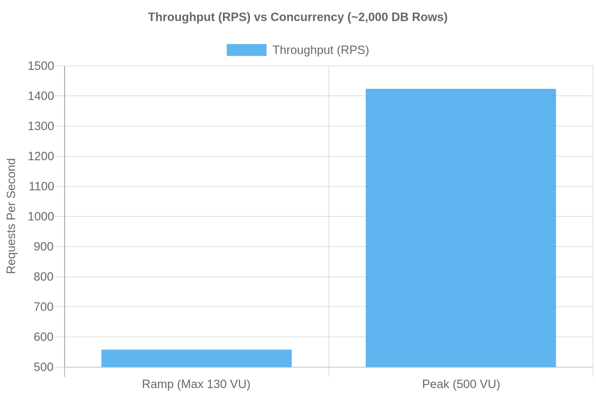
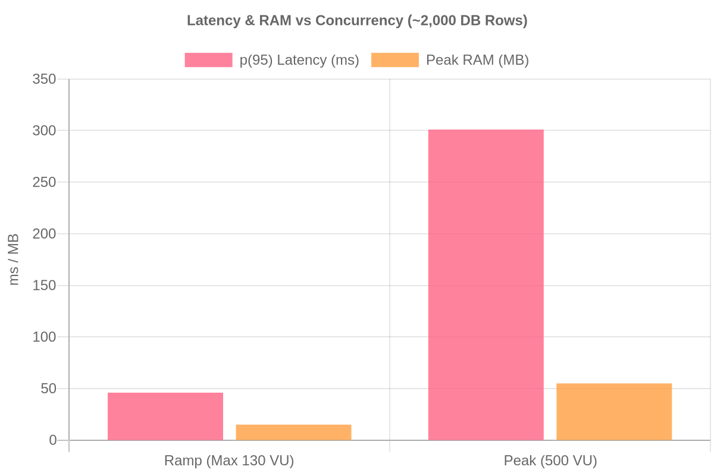

<div align="center">
  
  <p>A CRM and internal operations portal designed with strict role-based access control and a minimal-dependency backend architecture.</p>
</div>

> Note: The frontend was rapidly prototyped and generated using AI.

## Architecture & Features

The backend is a REST API written in Go. It uses a layered architecture (Handlers → Services → Repositories) and the standard library `net/http` multiplexer for routing.

### Core Features

- **Layered Architecture:** Separation of concerns between HTTP handlers, business logic, and database access.
- **Docker Builds:** Multi-stage Alpine Dockerfiles that produce a compiled backend binary of just **~15MB**.
- **Database:** PostgreSQL integration using the native `jackc/pgx/v5` driver.
- **Migrations & Seeding:** Raw SQL migration flow. Includes a standalone `cmd/seed` binary to populate synthetic relational data.
- **Object Storage:** Cloudflare R2 integration (via AWS SDK S3-compatible API) for avatar and file uploads.

### Security & Middleware

- **Authentication:** Stateless JWT-based authentication for endpoints across three roles (Admin, HR, Employee).
- **Rate Limiting:** In-memory token bucket rate limiting (`golang.org/x/time/rate`) implemented as middleware.
- **Panic Recovery:** Custom middleware to catch and recover from panics.
- **Graceful Shutdown:** Intercepts OS termination signals to drain active HTTP connections and close database pools before exiting.

### Development Setup

- **API Documentation:** Interactive Swagger UI generated via code comments (`swaggo/swag`).
- **Testing & Mocks:** Unit tests for critical endpoints using injected mock repositories.

## Technology

- **Backend:** Go, net/http, PostgreSQL (pgx), JWT
- **Frontend:** TypeScript, React, TanStack Start, Tailwind CSS, Bun
- **Infrastructure:** Docker, Docker Compose, Cloudflare R2 (S3-compatible API)

## Performance Benchmarks

**Target**: `GET /api/search?q=<term>` (Admin role, 3 concurrent DB queries per request)  
**Constraint**: 0.5 vCPU / 256 MB RAM  
**Dataset Size**: ~2,000 rows  
**Tool**: Grafana k6

<p align="center">
  
  
</p>

### Results

| Scenario       | Concurrency (VUs) | Throughput (RPS) | p(95) Latency | Peak RAM | CPU Usage | Error Rate |
| -------------- | ----------------- | ---------------- | ------------- | -------- | --------- | ---------- |
| CPU Boundary   | Ramp (Max 130)    | 558              | 46.5ms        | ~15 MB   | ~50%      | 0%         |
| Pool Exhausted | 500               | 1,424            | 301.7ms       | ~55 MB   | ~50%      | 0%         |

- **Safe Capacity (~550 RPS)**: The application processes requests smoothly up to roughly ~550 RPS.
- **Absolute Ceiling (~1,424 RPS)**: The server can physically process a maximum of ~1,424 requests per second, but latency degrades significantly as users wait in the queue.
- **Connection Pooling**: At 500 concurrent connections, the database pool is exhausted. Requests are queued, resulting in a 0% error rate but inflating p(95) latency to 301.7ms as connections are awaited.
- **Memory Efficiency**: The server uses ~11 MB at idle/low load and peaked at ~55 MB under extreme congestion.

### Reproduce

Start the application with Docker constraints applied, retrieve an admin JWT token, and execute the load script (might have to seed db and remove rateLimiter Middleware):

```bash
# 1. Start bounded containers
docker compose -f compose.yaml -f compose.bench.yaml up --build -d

# 2. Find CPU boundary (Arrival rate ramp)
k6 run --env TOKEN=<admin_jwt> --env MODE=ramp scripts/search_load.js

# 3. Test pool exhaustion (500 VUs)
k6 run --env TOKEN=<admin_jwt> --env MODE=peak scripts/search_load.js
```

## Environment Variables

The project uses `.env` files to manage configuration. Example files are provided in both the root and client directories.

### Backend

Copy the `.env.example` file in the root directory to `.env` and update it with your credentials.

### Frontend

Copy the `.env.example` file in the `client/` directory to `.env`.

## Setup

Start the PostgreSQL database in the background:

```bash
docker-compose up -d db
```

Make sure to change directory into the root before running the backend commands.

Populate the database with synthetic development data (optional):

```bash
go run ./cmd/seed
```

Start the API server:

```bash
go run ./cmd/api
```

The backend server runs on `http://localhost:4000`. API documentation is available via Swagger at `http://localhost:4000/swagger/index.html`.

### Frontend Setup

Make sure to change directory into `client/` before running the frontend commands.

Install dependencies:

```bash
bun install
```

Start the frontend development server:

```bash
bun run dev
```

The frontend runs on `http://localhost:3000`.

## Deployment

Both the client and server are containerized. The backend expects the application to bind to the `$PORT` environment variable and can be deployed to any standard container orchestration platform.

## License

This project is licensed under the AGPL-3.0 License
